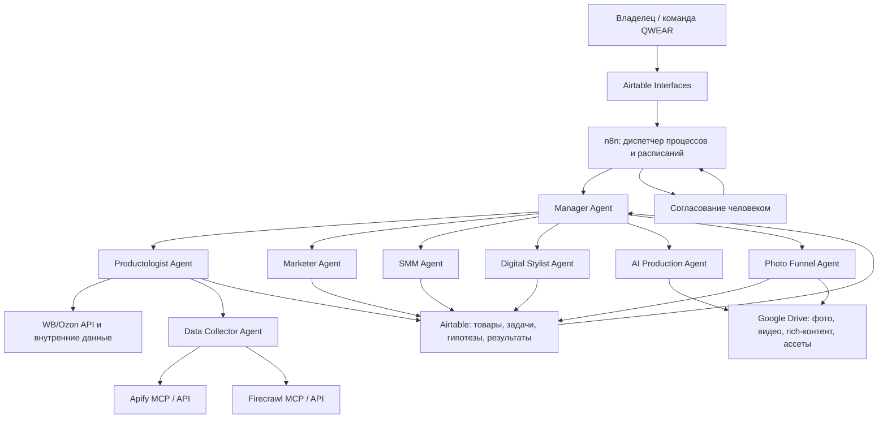

# Техническая Архитектура Виртуального Офиса QWEAR

Дата решения: 2026-06-08

## Короткий Ответ

Виртуальный офис не должен строиться на одном плагине.

Он состоит из пяти слоев:

```text
Интерфейс человека
-> Оркестратор процессов
-> AI-агенты
-> Инструменты и плагины
-> Данные и файлы
```

Для первого рабочего MVP рекомендуется:

```text
Airtable + Google Drive
        +
       n8n
        +
 OpenAI Agents / API
        +
 WB/Ozon API + Apify + Firecrawl
```

## Рекомендуемая Архитектура



## На Базе Чего Собираем

### 1. Airtable: интерфейс и операционная база

Airtable используется не как интеллект, а как единый реестр и интерфейс:

- товары и модели;
- задачи агентов;
- статусы;
- гипотезы;
- контент-план;
- результаты тестов;
- winners;
- решения человека.

Преимущество: данные видны как карточки, канбан, календарь, галерея, формы и dashboard.

Существующие Google Sheets остаются источником производственных данных и могут синхронизироваться через n8n.

### 2. Google Drive: файловое хранилище

Хранит:

- исходные фото;
- rich-контент;
- инфографику;
- видео;
- production-ассеты;
- отчеты;
- approved / rejected версии.

В Airtable хранятся ссылки на файлы Drive и при необходимости preview-вложения.

### 3. n8n: диспетчер виртуального офиса

n8n рекомендуется как первый оркестратор, потому что он умеет:

- запускать процессы по расписанию;
- принимать webhooks;
- обращаться к API;
- запускать AI Agent nodes;
- подключать инструменты;
- ожидать согласование человека;
- записывать результаты в Airtable;
- хранить статусы выполнения и ошибки.

Пример процесса:

```text
Новый Product со статусом Focus
-> n8n запускает Productologist
-> при нехватке данных запускает Data Collector
-> записывает вывод в Airtable
-> отправляет решение человеку на согласование
-> после согласования запускает Marketer, Digital Stylist и SMM
```

### 4. OpenAI Agents / API: интеллект

Описанные нами файлы агентов становятся:

- system instructions;
- правилами принятия решений;
- схемами входов и выходов;
- ограничениями;
- шаблонами отчетов.

OpenAI Agent Builder можно использовать для визуального прототипирования workflows.

Для более управляемой production-системы подойдет Agents SDK или обычные API-вызовы из n8n.

### 5. MCP / API: инструменты агентов

MCP и API дают агентам доступ к внешним действиям и данным.

## Какие Плагины И Интеграции Нужны

### Обязательные Для MVP

| Интеграция | Для чего нужна | Приоритет |
|---|---|---|
| Airtable | Интерфейс, рабочие данные, задачи, согласования и результаты | Обязательно |
| Google Drive / существующие Sheets | Файлы и производственные данные | Обязательно |
| WB/Ozon API | Продажи, заказы, остатки, выкуп, отзывы и внутренняя аналитика | Обязательно |
| OpenAI API / Agents | Работа специализированных агентов | Обязательно |
| n8n | Оркестрация, расписания, согласования и передача данных | Обязательно |

### Для Внешнего Сбора Данных

| Интеграция | Для чего нужна | Приоритет |
|---|---|---|
| Apify MCP / API | Pinterest, Instagram, TikTok, Amazon, карточки и конкуренты через Actors | Высокий |
| Firecrawl MCP / API | Чтение сайтов, каталогов, статей и страниц в структурированном виде | Средний |
| Browser | Ручная проверка страниц и результатов сбора | Высокий |

### Для Производства Контента

| Интеграция | Для чего нужна | Приоритет |
|---|---|---|
| Генерация изображений | Образы, варианты, moodboards, rich-визуалы | Высокий |
| Сервис генерации видео | Оживление изображений и короткие ролики | Высокий после первого контент-плана |
| Figma / Canva | Финальная верстка rich-контента и инфографики | Средний |
| Планировщик публикаций / API соцсетей | Публикации и сбор метрик | Позже |

### Не Нужны На Старте

- отдельное собственное приложение;
- сложная CRM;
- vector database для всех данных;
- сетка аккаунтов;
- ферма телефонов;
- полностью автономные публикации без согласования;
- отдельный агент под каждое мелкое действие.

## Какие Плагины Нужны Codex Для Дальнейшей Работы

В текущей среде уже полезны:

- Airtable;
- Google Drive / Google Sheets;
- GitHub для версий архитектуры и кода;
- Browser для проверки интерфейсов и сайтов;
- Image generation для визуальных тестов.

Следующие внешние подключения:

1. Apify MCP.
2. Firecrawl MCP.
3. Доступ к WB/Ozon API через безопасные credentials.
4. n8n instance с доступом к Airtable, существующим Google Sheets, OpenAI и API маркетплейсов.
5. Позже: Figma или Canva и сервис генерации видео.

## Роль Человека

На старте система не должна работать полностью автономно.

Обязательное согласование человека:

- запуск новой модели;
- изменение карточки;
- публикация спорного контента;
- расход бюджета;
- изменение цены / скидки;
- закупка / производство;
- внешние обещания по посадке, ткани и plus size.

## Первый Реальный Workflow

Начинать нужно с одного процесса:

```text
Человек выбирает товар в Airtable
-> Manager Agent создает задачи
-> Data Collector собирает данные
-> Productologist формирует факт / гипотезу / риск
-> человек согласует
-> Marketer формирует оффер
-> Digital Stylist создает rich-план
-> SMM создает 5 hook cards и контент-план
-> AI Production создает production briefs
-> результаты записываются в Airtable и Drive
```

## Этапы Внедрения

### Этап 1. Видимая Система

- одна Airtable Base `QWEAR Virtual Office`;
- таблицы Products, Agents, Tasks, Content Assets, Approvals;
- три интерфейса: владелец, агенты, контент;
- папка Drive для каждого товара;
- ручной запуск агентов.

### Этап 2. Полуавтоматизация

- n8n запускает workflow из новой строки;
- агенты пишут структурированный результат;
- согласование человека перед следующим этапом;
- API кабинета подключено.

### Этап 3. Внешние Данные И Контент

- Apify / Firecrawl;
- автоматический мониторинг конкурентов;
- production-пайплайн;
- сбор метрик соцсетей;
- обновление winners.

### Этап 4. Расширенный Интерфейс Виртуального Офиса

Только после доказанного workflow можно заменить Airtable Interfaces отдельным приложением:

- dashboard задач;
- карточки агентов;
- approvals;
- статусы;
- отчеты;
- история решений.

## Решение

Первый виртуальный офис QWEAR строим не как приложение, а как связку:

```text
Airtable = интерфейс и операционные данные
Google Drive / существующие Sheets = файлы и производственные данные
n8n = процессы и расписания
OpenAI = агенты и решения
MCP / API = инструменты и внешние данные
человек = контроль критических решений
```
